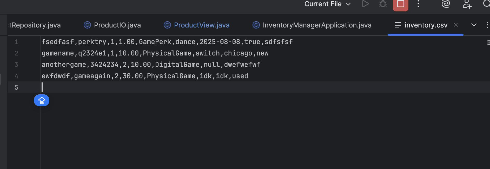

# Chatting about the inventory manager

1. Create the Spring application and load into intelliJ
2. Created my pojos - use of inheritance 

# To Do
- [x] Domain models
- [ ] Create Repository
    - [ ] In Memory
    - [ ] CSV Repo
- [ ] Service
- [ ] IO
- [ ] Main
- [ ] Unit Tests
- [ ] File handling works (problems in airport)

- [ ] Abstract class
- [ ]Refactor 
  - try to use an enum for game condition
  - maybe add more product types with dates, ints, etc
# Learning
How service stays flexible
Dependency Injection:

ProductService service = new ProductService(new CsvProductRepository());
vs

ProductService service = new ProductService(new InMemoryProductRepository());

- Same service, different repo — so your tests stay fast and your production logic stays persistent.

---
**CSV Output Comparison**

Current Format

The image below shows the current output of the CSV file, where each row is printed differently depending on the product type:

This structure:
- Has different numbers of columns per row
- Is hard to import into tools like Excel or MySQL
- Makes parsing and maintenance error-prone
- Has no consistent header, so column meanings are unclear

What I’m Changing It To -> I'm switching to a unified CSV format where every row has the same columns, even if some values are left blank

---
## CSV Output Notes

- PhysicalGame: All fields print correctly.
- DigitalGame: Platform is null.
- Merch: Only base fields print; missing merchType, size, and weight.
- GamePerk: All fields print correctly.

### Fixes
- [ ] Check platform assignment in DigitalGame.
- [ ] Verify Merch type handling logic.

---
Eric's note to add validation to one layer -> pick and stick with it

---
# Questions