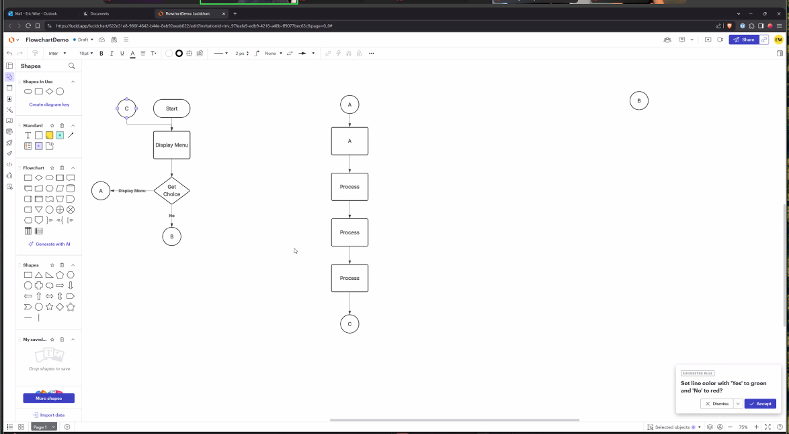
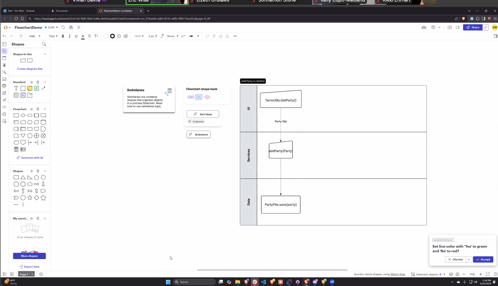
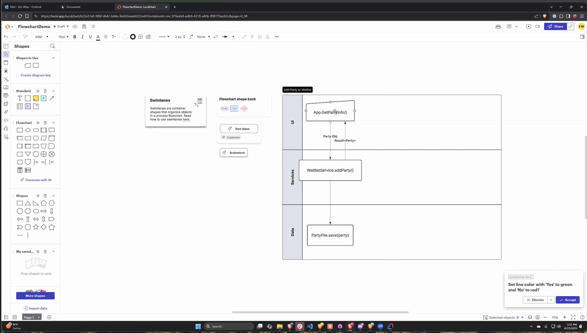

# Thoughts and notes

## Planning
Main Menu
1. Display Cart
2. Remove an Item
3. Add an Item
4. Checkout
5. Exit

What objects (classes) will be incolved

NO NEED -> this is the same as the service

~~- cart~~  
~~-   hold items~~  
~~-   empty cart~~  
~~-   check items~~

- io
  - printing
  - input
- cart service
  - contains business logic
  - add item
  - remove item
  - display item.. (io?)
  - checkout items
  - calculate price
  - 
- items??
  - hold data/info on product
  - user inputting?
- maybe menu
  - menu loop

Packages
ui
- io
- maybe menu(add later)
model
- cart
- item
service
- service

Where would the ... go?
- Map element
  - cart - tracks how many of each item
- List element
  - cart service 
- Interface
- each feature is isolated into a separate method 

---

## Steps
1. Utils 
2. service and add some tests
3. went back and added item model, should have done this first bc I was not able to start tests without passing data
- tests went fairly easy, at some point realized i kept repeating adding the service, so did a before each
- also nextr time, add one method to the service, test it, one method, test, like I was doing w printing -> we can have one shopping cart that only adds, no need to add all methods at once.... go slow
- do i even need shopping cart model... have not needed so far, the service is the model
  - i think i was thinking it would hold items, idk..delete it -> cart and cart service are the same(look at notes above)
- moving on..
4. get the app running
   - create the service
   - add io
   - add while loop
- when using cases, add the break after the entire case otherwise, it seems to end the program

5. add a factory to cfreate items - EXAMPLE
```
   package com.example.factory;

import com.example.choice.*;
import com.example.model.*;
import java.util.Scanner;

public class PlayerFactory {
private Scanner scanner;

    public PlayerFactory(Scanner scanner) {
        this.scanner = scanner;
    }

    public Player create(PlayerType playerType) {
        ChoiceStrategy strategy;

        if (playerType == PlayerType.COMPUTER) {
            strategy = new RandomChoiceStrategy();
        } else {
            strategy = new TerminalChoiceStrategy(scanner);
        }

        return new Player(strategy);
    }

}

```
//A factory will make things cleaner when creating an object...
/*
- example get rid of creating items all over the place, will be much easier to refactor

so.. instead of new ITem(name, price)
I can just put itemFactory.createItem(name, price) -> when we add the hashmap, it should be easier to refactor
*/


FACTORY
- this is creating the object instead of leaving it in the service, which then would be creating and adding the object
- the factory only cares about making more items
- the shopping cart service is the project manager that moves the items around
  - adds(ONLY ADD), remove, tally up total

- only changes made will be on the service (change add method) and the main app...
- make changes to tests
```
// REFACTOR - here the item will be created by the factory, them we just pass the item
//scs.addItem("Shirt", 50.0);
        Item shirt = itemFactory.createItem("Shirt", 50.0);
        scs.addItem(shirt);
```

6. Add hash map to track quantities
- refactored add to increment quantity, not replace... do the rest
- refactor tests
  - when refactoring tests, cane across issue, do not want to creat duplicate shirt objects
    - so thoughts on this, allow the user to create a shirt object (rather than many different objects in memory)
    - I created 2 different Item objects
      - why? bc ***shirt does not equal shirt*** even though they look the same (name = "shirt", price = 10.00)
      - i am not reusing a sinlg object, i am instantiating the same object blue print twice
      - they live at different memory locations, so I am buying 2 different shirt objects, both objects are at the array list
      - NOT 1 shirt object with quantity 2
....so..

7. Add inventory or collections class 
  - as i think about this, I will probably add my interface here
    - bc i want user to be able to add items - or is that inheritance...
    ```
      design the items class
      extend into different types of items,
      print the items
      then next thing would be to design collection class, add items, hold items, make it displayable
    ```
    
8. OK PLAN
- add another hashmap into app, to be able to store the item objects and call them when the user inputs the name 
- add this logic to app
- then refactor bc methods are getting long
- then move methods to executes..
  - this is where i can add a customize the item, as originally was in the instructions
  
let me explain what is currently happening 
CURRENTLY, I created the Inventory class...
The inventory class is being used to store available items using the hashmap
- this allows all product info, name price, be in one place and managed so like the service for the items kinda??
- so it:
  - holds items in a hashmap
  - preloads the items when the app starts
  - give access to the methods like adItem, hasitem, get item, display inventory
It is not wired into any app logic, so even though the items are created and preloaded
  - the user does not see it, its not in th ui

9. BAck to coding -> finish implementing the hashmap into app
   - add an item
     - ask the user what item they want in the cart
     - check if the inventory has the item
       - if no, "no item in inventory"
       - if yes, ask how many 
         - loop for however many item quantity
   

  - delete an item
....
  - when i add the shirt, its still adding two copies of the same object, but keeping track of quantities
    - its adding to the list (shirt, shirt ) , instead of (shirt -> 2) using a hashmap
    - to keep track of quantities more cleanly, i would need to add a hashmap tio the service?

i went from orignially, making copies of the object,
but still adding 2 different shirt objects each time the user added somethingm, 
now im making copies of the object by adding the same object twice,
next i want to just add the object X 2 using a hashmap
-> the app works, taking a break from hashmap, i will need to hashmap service to get wuantity later

10. command pattern for actions

---
# Reminders
- add try catch at end
- add validation?
- finish item factory 
  - working on tests, idk if app is running bc tests - i assume i will need to connect utils???
- refactor hash map to add qty
- refactor to add interface commands - review
- refactor - some repition in main app


# Questions

# Class
- flowcarts... try to start using for next project
  

- next step of documentation and planning
  - use swimlane
  - helps visualize how the different objects interact with each other
  - make one swom lane for each process -> add a party, remove a party, etc.
    - what methods are called, what data comes back

  
  

- keep models very clean -> no getters and setters (bc json)
  
...
ADD PEP TAKK FROM MON JUN23, befre class ends, 
gives workdlow tips
refactor tips

-----

//interface called shoppable
//if all items are media, then mayb your can interface of consume media, play media,
//functions for shopping cart based on the interface
//class will  - interface is for designing multiple dfifferent shopping carts

    }

    //if I have a collection of employees


    //main menu
    // we do not know ehn the user is going exit -> going through a predictable series of steps
    //unpredictable -> woould use a while loop


    // Top down and bottom up approaches to writing out the program
    //top down
    //user interface - print out he menu, get this into a loop, when the user hits 5, exit thje loop,
    //then start adding functionality bit by bit
    //add item first, write code thaty makes the add item first, add print statemtns
    //NOW you cna add items then exit

    //NEXT logical think
    //display the items


    //now we have add items, display and exit

    // next checkout

    //REMOVE from the cart is the fianl thing i would write


    //NOW WHEN WE HAVE THE FUNCTIONALITY.
    //we think abouyt what is an item
    // thenj start with abstract items


    //perishable vs decorations
    //last step is the content


    //BOTTOM
    /*
    design the items class
    extend into different types of items,
    print the items
    then next thing would be to design collection class, add items, hold items, make it displayable,
    then last thing would be main ->

