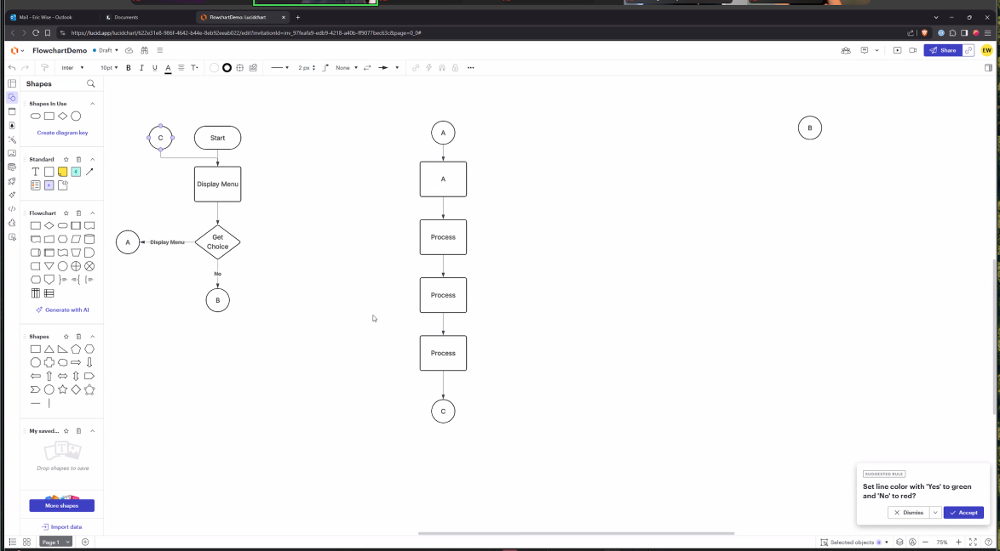
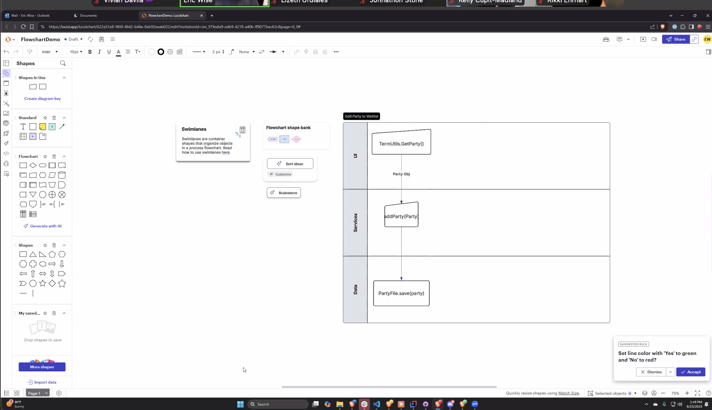
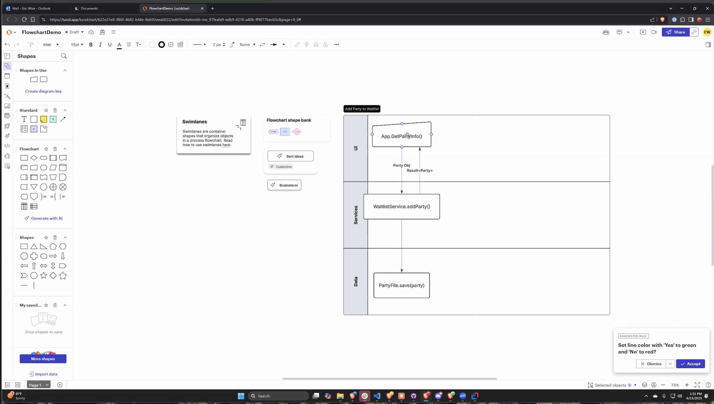

# Thoughts and notes

## Planning
Main Menu
1. Display Cart
2. Remove an Item
3. Add an Item
4. Checkout
5. Exit

What objects (classes) will be incolved

NO NEED -> this is the same as the service

~~- cart~~  
~~-   hold items~~  
~~-   empty cart~~  
~~-   check items~~

- io
  - printing
  - input
- cart service
  - contains business logic
  - add item
  - remove item
  - display item.. (io?)
  - checkout items
  - calculate price
  - 
- items??
  - hold data/info on product
  - user inputting?
- maybe menu
  - menu loop

Packages
ui
- io
- maybe menu(add later)
model
- cart
- item
service
- service

Where would the ... go?
- Map element
  - cart - tracks how many of each item
- List element
  - cart service 
- Interface
- each feature is isolated into a separate method 

---

## Steps
1. Utils 
2. service and add some tests
3. went back and added item model, should have done this first bc I was not able to start tests without passing data
- tests went fairly easy, at some point realized i kept repeating adding the service, so did a before each
- also nextr time, add one method to the service, test it, one method, test, like I was doing w printing -> we can have one shopping cart that only adds, no need to add all methods at once.... go slow
- do i even need shopping cart model... have not needed so far, the service is the model
  - i think i was thinking it would hold items, idk..delete it -> cart and cart service are the same(look at notes above)
- moving on..
4. get the app running
   - create the service
   - add io
   - add while loop

# Reminders
- add try catch at end
- add validation?

# Questions

# Class
- flowcarts... try to start using for next project
  

- next step of documentation and planning
  - use swimlane
  - helps visualize how the different objects interact with each other
  - make one swom lane for each process -> add a party, remove a party, etc.
    - what methods are called, what data comes back

  
  

- keep models very clean -> no getters and setters (bc json)
  
...
ADD PEP TAKK FROM MON JUN23, befre class ends, 
gives workdlow tips
refactor tips

-----

//interface called shoppable
//if all items are media, then mayb your can interface of consume media, play media,
//functions for shopping cart based on the interface
//class will  - interface is for designing multiple dfifferent shopping carts

    }

    //if I have a collection of employees

    //main menu
    // we do not know ehn the user is going exit -> going through a predictable series of steps
    //unpredictable -> woould use a while loop

    // Top down and bottom up approaches to writing out the program
    //top down
    //user interface - print out he menu, get this into a loop, when the user hits 5, exit thje loop,
    //then start adding functionality bit by bit
    //add item first, write code thaty makes the add item first, add print statemtns
    //NOW you cna add items then exit

    //NEXT logical think
    //display the items

    //now we have add items, display and exit

    // next checkout

    //REMOVE from the cart is the fianl thing i would write

    //NOW WHEN WE HAVE THE FUNCTIONALITY.
    //we think abouyt what is an item
    // thenj start with abstract items

    //perishable vs decorations
    //last step is the content

    //BOTTOM
    /*
    design the items class
    extend into different types of items,
    print the items
    then next thing would be to design collection class, add items, hold items, make it displayable,
    then last thing would be main ->

