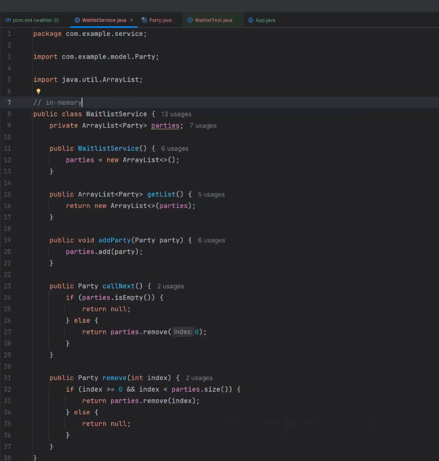
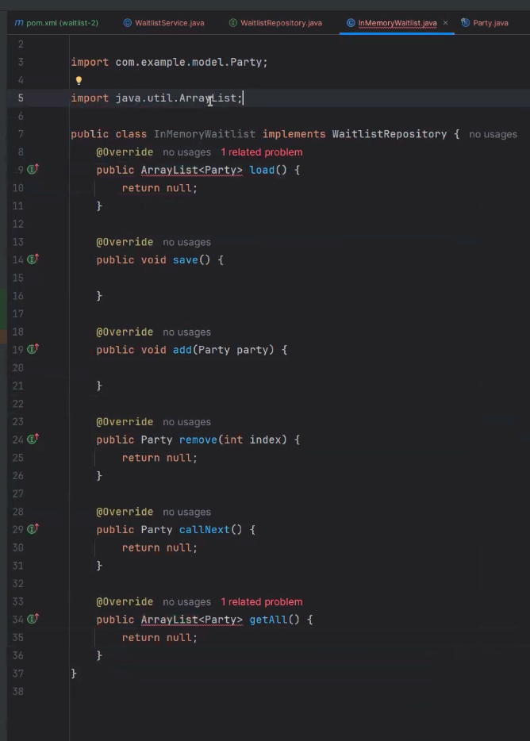
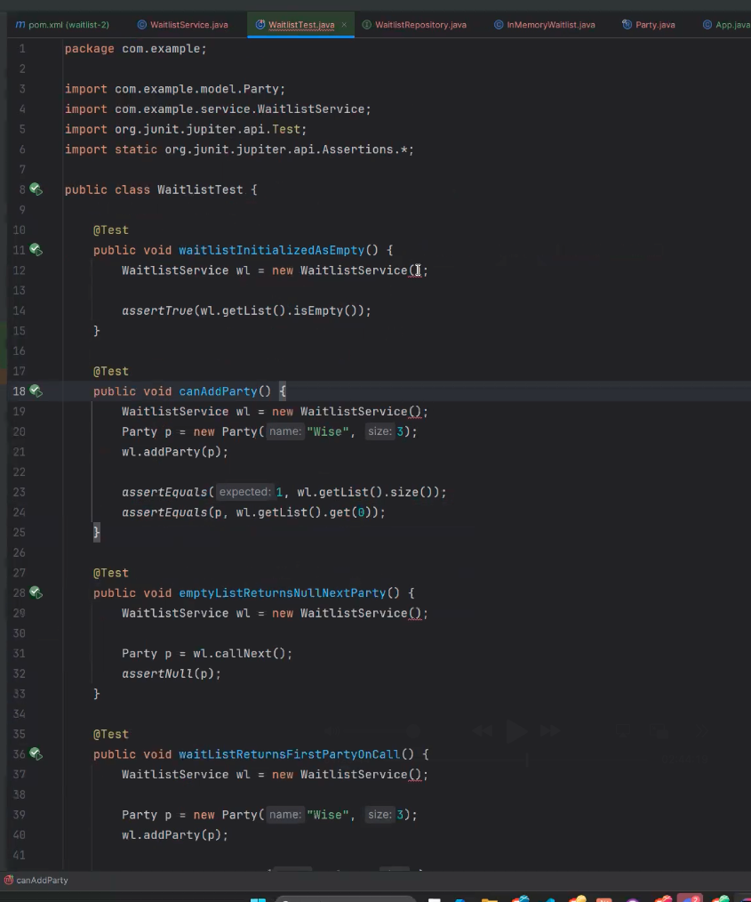

## WaitlistService
- Start the app with only model->Party, service->WaitlistService, and App(Main)
The waitlist service right now is currently doing in memory
- Add interfaces and fileio

- Because we are using an array list...
  - There is no reading and writing to files, no database, no api
  - ... if we start building the waitlist, then turn off the app
    - nothing is saved, day is gone
- Add persistance
  - At the same time, for the unit tests, propably do not want to be reading and writing to files
    - Unit tests do not necessarily want to be changing data, or persisting -> that's a different type of test called an integration test
        - ... unit test oly should test functionality, no need to access external resources

- So we have a situation now where we want to change the behavior of a class
  - sometimes we want it to read and write to a file, other times we want it to stay in memory
    - how should we do this?
    - **A. create another package and call it repository(can also call it data)**

## WaitlistRepository
### A. Add an interface and call it an name to indicate its an io or repository
- What are the things we need to be able to do
  - need to get a list of parties
  - add all functionality that we might want to have for working with a waitlist
  - added load and save for files
- **B. so then you are going to create a new java class -> call it the in memory waitlist**

## InMemoryWaitlist
### B. So then you are going to create a new java class -> call it the in memory waitlist
- This will look a lot like our waitlist service
  - Implement all the methods from the waitlist service (there was a shortcut here)


- Set up before additions made

- If your save is in memory, you are not saving anything to the system

- All copied for the most part form regular waitlist service -> does all as original service does

## WaitlistService
- back to WLS -> you can inject your interface
```
public WaitlistService() {
  parties = new ArrayList<>();
}
```
**INJECT THE INTERFACE**
```
public WaitlistService(WaitlistRepository repository) {
  parties = new ArrayList<>();
}
```
- then get rid of the array list
```
//DELETE
private ArrayList<Party> parties;
```
- Add the waitlist repository field that we are going to assign in injected interface

```
 WaitlistRepository repository;
 
 public WaitlistService(WaitlistRepository repository) {
        this.repository = repository;
    }
```

- So now that we started moving all the stuff out to the interface, this service starts to become interesting

- Changes made...
```
  WaitlistRepository repository;

    public WaitlistService(WaitlistRepository repository) {
        this.repository = repository;
    }

    public ArrayList<Party> getList() {
        return this.repository.getAll();
    }

    public void addParty(Party party) {
        this.repository.add(party);
    }

    public Party callNext() {
        return this.repository.callNext();
    }

    public Party remove(int index) {
        return this.repository.remove(index);
    }
```

- Then once changes are made, go to the tests
- C. Go to the WaitlistTest

## WaitlistTest


- For example
- here where we are initializing
```
  public void waitlistInitializedAsEmpty() {
        WaitlistService wl = new WaitlistService(new InMemoryWaitlist());

        assertTrue(wl.getList().isEmpty());
    }

```
- inject

```
  public void waitlistInitializedAsEmpty() {
        WaitlistService wl = new WaitlistService(new InMemoryWaitlist());

        assertTrue(wl.getList().isEmpty());
    }

```

1.28